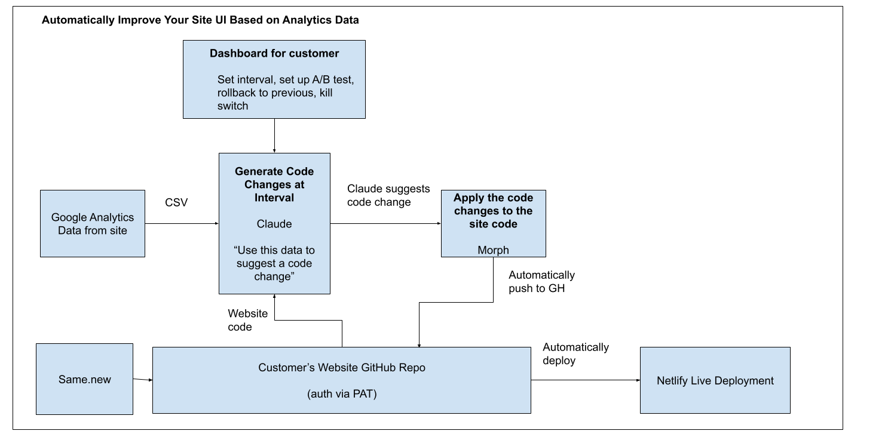

# Self Improving Website - YC Hackathon 08.09.2025

## Hackathon

This was a **half-day hackathon** focused on building **AI-powered coding tools and agents**. It was hosted at **YC headquarters in SF**. 

 


## Group 

From strangers to friends!! 👯 

Laura Chirila (github: @ChirilaLaura), Ben Eadie (github: @beneadie), and I met on the day of the hackathon, and it turned out to be a **fantastic group**!  

Laura brought the idea of **a self-improving website**. 


## Project Problem 

Website owners already have access to tons of analytics data about their site. Tools like Google Analytics allow them to see metrics like how many people clicked a button (**click-through rate**) and how long users spent on the site (**average session duration**). 

Currently, improving a site means manually analyzing this data and then making code edits to the webpage source code. 

We wanted to skip all that manual analysis and decision-making by **automating the process with an agent**.  

Our agent automatically:  
1. Analyzes website data from **Google Analytics** 📊  
2. Decides on the best improvements 💡  
3. Edits the site’s code 🛠️  
4. Pushes the update **live to the web** 🚀  


## Architecture

- We designed the following architecture for our project: 




1. **Google Analytics Data**  
   - Exported as CSV from the site.  

2. **Generate Code Change Suggestions** (Claude)  
   - Uses analytics data and website code.  
   - Generates **code change suggestions** at set intervals.  

3. **Apply Code Changes** (Morph)  
   - Applies changes to the site code.  

4. **Version Control & Deployment**  
   - Automatically pushes updates to **GitHub**.  
   - Automatically deploys via **Netlify**.  

5. **Customer Dashboard**  
   - Set intervals, run A/B tests, roll back changes, or stop updates.  

6. **Same.new Integration**  
   - Can send website code directly to the GitHub repository.


# How to Run This Code 

Analyze a CSV of engagement metrics and **auto‑enhance HTML**. Run locally as a **Streamlit** app or call the core class directly.

## Requirements
- Python 3.9+
- `pip install -r requirements.txt` (see below)

### Python packages
```
streamlit
gitpython
anthropic
openai
requests
```
> Optional extras: any CSV tool you prefer; the app accepts raw text CSV.

## Environment Variables (required/optional)
- **`ANTHROPIC_API_KEY`** *(required)* — API key from Anthropic console.
- **`MORPH_API_KEY`** *(required)* — API key for Morph.
- No GitHub env vars are required; the Streamlit UI asks for **GitHub token**, **username**, **owner**, **repo**, **branch**, and **file path** when you choose the GitHub workflow.

> GitHub token scopes: `repo` (private or public). If the org uses SSO, be sure to **authorize the token for that org**. 403 errors usually mean missing scope or SSO not enabled.

## Run (Streamlit UI)
```bash
# from the project root
streamlit run streamlit-github.py
```
1) Open the app in your browser (Streamlit prints the URL).
2) Expand **Required API Keys** and paste your keys (pre-fills from env if set).
3) Choose a workflow:
   - **Upload HTML File** → upload CSV + HTML, then **Analyze & Enhance** → download result.
   - **GitHub Repository** → enter repo details; the app will fetch, enhance, and **push** a commit.

## Programmatic Use
```python
from Claude_Morph_Edit_HTML_GH_or_Upload import create_enhancer_from_env

enhancer = create_enhancer_from_env()  # uses ANTHROPIC_API_KEY and MORPH_API_KEY
html = Path("page.html").read_text()
csv  = Path("metrics.csv").read_text()

# returns (enhanced_html, edit_summary)
enhanced, summary = enhancer.enhance_html_with_data(csv, html)
Path("page.enhanced.html").write_text(enhanced)
```

## Troubleshooting
- **403 when pushing to GitHub** → check PAT scopes and SSO org authorization.
- **Missing keys** → ensure `ANTHROPIC_API_KEY` and `MORPH_API_KEY` are set or pasted in the UI.
- **CSV issues** → ensure it’s plain‑text CSV (UTF‑8 preferred).

## Example `.env`
```
ANTHROPIC_API_KEY=sk-ant-...
MORPH_API_KEY=sk-morph-...
```


# Also check out the code we built with Same.New

- we explored a frontend with Same.New that I didn't include here - https://github.com/beneadie/seo-agent-dashboard

